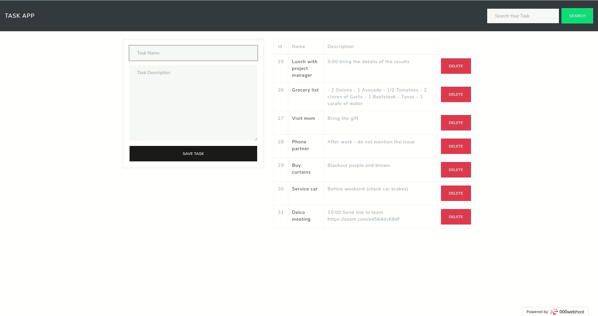

Task App
==============

### Built with

- HTML
- Bootstrap
- JS

## :deciduous_tree: Live Version
[Click](https://brtaskapp.000webhostapp.com/)

 

## 🤝 Contributing

Contributions are more than welcome! Feel free to check [issues page](https://github.com/ricardovaltierra/task-app/issues).

1. Fork (https://github.com/ricardovaltierra/task-app/fork)
2. Create your working branch (git checkout -b [branch_name])
3. Commit your changes (git commit -am 'what you will add or fix or improve')
4. Push (git push origin [branch_name])
5. Create a PR

## 🤖 Contributor

Ricardo Valtierra - [GitHub](https://github.com/ricardovaltierra)

## 🙋‍♂ Support :)

Give a ⭐️ if you liked it!

## 📝 License

This project is under the [MIT](LICENSE) license.